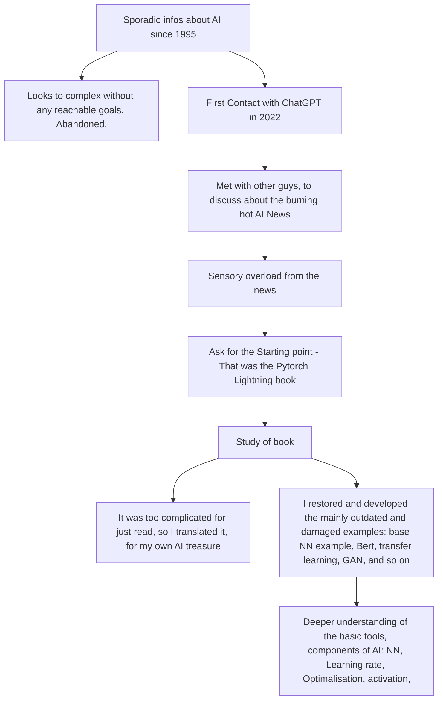

# VMI_CV_AI - My Curriculum Vitae - AI aspect

```mermaid
graph TD
    A[Sporadic infos about AI since 1995] --> B[Looks to complex without any reachable goals. Abandoned.]
    A --> C[First Contact with ChatGPT in 2022]
    C --> D[Met with other guys, to discuss about the burning hot AI News]
    D --> E[Sensory overload from the news]
    E --> F[Ask for the Starting point - That was the Pytorch Lightning book]
    F --> G[Study of book]
    G --> H[It was too complicated for just read, so I translated it, for my own AI treasure]
    G --> I[I restored and developed the mainly outdated and damaged examples: base NN example, Bert, transfer learning, GAN, and so on]
    I --> J[Deeper understanding of the basic tools, components of AI: NN, Learning rate, Optimalisation, activation, ]
    
```
