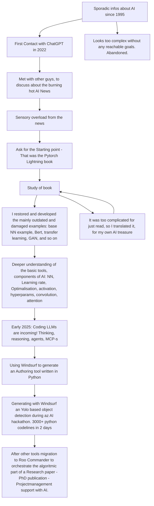

# VMI_CV_AI - My Curriculum Vitae - AI aspect

## More about the AI supported project management research:
Because even Windsurf gives a proof about the ability of the LLMs to code AI model contained codes, and the existing LLM tools were not able to understand the difference between costs and invoices (!!!), I introduced the project manager colleagues that the vivid solution is an LLM with Retrieval-Augmented Generation. Let algoritms do the calculations (through prescribed rules), but rise the interface to another level with a LOCAL LLM model, that able to understand the questions, find the prescribed rule, search the datas from vectordb, and wrap the answer into a natural language answer. I suppose that the resource progress and the fails are important part of the publication. And even the abilities of the actual code generator models. Because of that, at the beginning I introduded to the AI tool the human actors. Reason is: I want to  orchestrate the work process well documentate the progress and the reasons, because it is a publication, not a product.

## Interesting infos about the SotA LLM code generators:
- Probably not the models but the background rules are the most precious part of this products.
- Most tools allowed to answer some direct question about its own architecture, until it not harms any business secret. This questions are very useful to reach better synergy with the models.
- The developer and AI must be at the same knowledge level. Generating an architecture of code, without understand the background increases some "entropy" and finally the code does not meet with the expectation, because the missing requirements are filled with some general practice.
- Very important part to give a positive feedback to the AI agents.

## My public repos about my earlier AI mockups:
- basic examples of AI models https://github.com/vmistvan/MIA_helyzet 
- speec recognition https://github.com/vmistvan/speech_recog
- short voyage into the SB3: https://github.com/vmistvan/SB3_Doc_Hun
